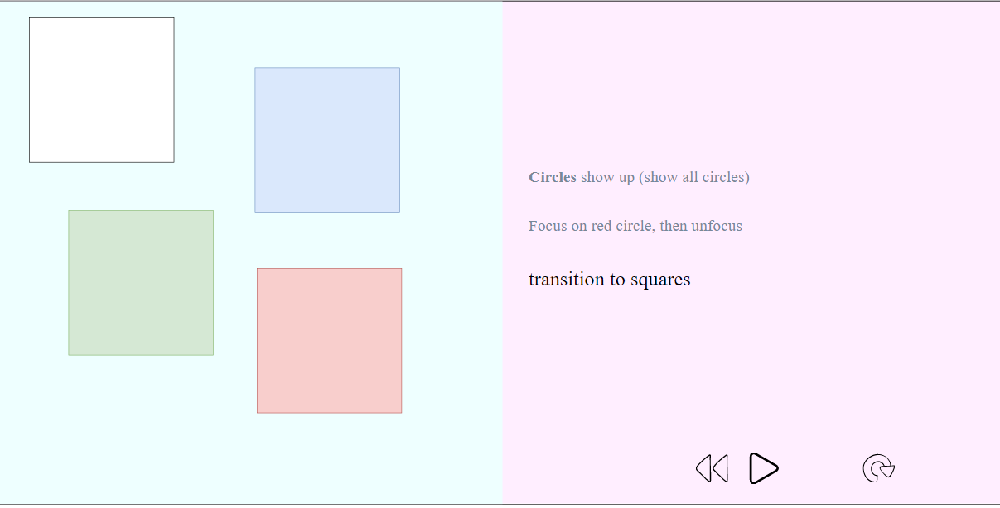

# slidego	
Tool to generate slide-shows from a simple YAML description and a bunch of SVGs, encapsulated in a single HTML file.

## Intro

A *nodejs* CLI tool to generate slides encapsulated in a single HTML file.

The slides are generated from a single YAML definition file and as many SVG files as needed to support your content.

The YAML definition specifies text selections to show during the slideshow.  It dictates what text to show when and which SVG files accompany that text.

Loading a slideshow in a browser (perhaps through an iframe), the viewer will see text on the right (bottom in portrait) and the SVGs on the left (top if portrait).  For example, below the current selected text is "Circle turns red." while showing an SVG image of a red circle:





## Prerequisites

Requires [npm](https://www.npmjs.com/get-npm).

## Installation

To install CLI tool:

```
npm install -g slidego
```

## CLI Usage

The tool works on folders containing a single YAML file constrained to a specific schema and any number of SVG files.

From any folder containing the requisite files, simply run:

```
slidego
```

The above will generate a `slideshow.html` file in the same folder.

Alternatively explicitly specify the folder containing your files:

```
slidego --folder <FOLDER>
```

For more help:

```
slidego --help
```

To quickly create a sample YAML and SVG files, go into an empty folder and:

```
slidego --seed
```

The above generated SVG files are empty except for containing a 1000x1000 pixel transparent rectangle.  You can use this rectangle as a guide boundary for your images.

## Quick Start

Starting from somewhere in your filesystem--whereever you're ready to create a folder for your slideshow:

```
npm install -g slidego
mkdir myslideshow
slidego --folder myslideshow --seed
./myslideshow/slideshow.html
```

Above, we accomplished the following:

- installed *slidego*
- made a new `myslideshow` folder for our new slideshow
- called *slidego* to seed the new empty `myslideshow` folder with a `slideshow.yml` file and two SVG files (referenced from the YAML file via `id` tags)
- since seeding also renders the slideshow, we opened the resultant slideshow in our browser.

## Creating Slides

##### The `./example` slideshow from the repo

This is a brief introduction of creating slides using the `./example` folder of the repository.  To get the `./example` folder onto your filesystem you need the repository, therefore, clone the repository somewhere on your filesystem:

```
git clone https://github.com/JakubNer/slidego.git
```

The rest of this write-up is relative to the repository folder cloned above:

```
cd <FOLDER CLONED ABOVE>
```

To get a feel for what's going on, generate this slideshow and open the resultant file in your browser:

```
slidego --folder ./example
```

Open the resultant slideshow for reference.  Open in your browser:

```
./example/slideshow.html
```

##### It's YAML

To effectively use this tool, you must be comfortable editing [YAML](https://en.wikipedia.org/wiki/YAML).

To see the example slideshow definition open `./example/slideshow.yml` file in a text editor.  It's repeated below for convenience:

```
min: 1em
max: 2.5em
svgPaneBackgroundColor: "#EEFFFF"
textPaneBackgroundColor: "#FFEEFF"
topBorder: solid 3px
bottomBorder: solid 3px
leftBorder: solid 0px
rightBorder: solid 0px
flipPanes: false
illustration:
- flows:
  - html: <b>Circle</b> shows up
    seconds: 2
    id: show-circle
  subsections:
  - flows:
    - html: Circle turns red.
      seconds: 2
      id: circle-red
    - html: Circle turns green,
      seconds: 1
      id: circle-green
    - html: " then blue."
      seconds: 1
      id: circle-blue
- flows:
  - html: <em>Square</em> shows up
    seconds: 2
    id: show-square
  subsections:
  - flows:
    - html: <a href="www.google.com" target="_blank">Square turns red</a>.
      seconds: 2
      id: square-red
    - html: Square turns green,
      seconds: 1
      id: square-green
    - html: " then blue."
      seconds: 1
      id: square-blue
```

This YAML file controls everything about the slide show.  The other files in the `./example` folder are the SVG files that are rendered in the slideshow when the appropriate *flow* is selected.

##### Font Sizes

The `min` attribute controls the font size for text that's not selected (not current focus of the slideshow).

The `max` attribute controls the font size for selected text (current focus of the slideshow). 

Font sizes are specified in CSS units: `em`, `px`, etc..

##### Pane Background Colors

```
svgPaneBackgroundColor: "#EEFFFF"
textPaneBackgroundColor: "#FFEEFF"
```

These specify the background color of the text and SVG panes.  

They're in CSS notation.

These are optional, defaults to white.

##### Borders

```
topBorder: solid 3px
bottomBorder: solid 3px
leftBorder: solid 0px
rightBorder: solid 0px
```

These specify the border around the slideshow, if any (set to `0px` for none).

These are in CSS notation.

These are optional, defaults to none.

##### Flip Panes (landscape)

```
flipPanes: false
```

In landscape mode:

- when this value is `false` the illustration is on the left and narration text on the right.  
- when this value is `true` the illustration is on the right and narration text on the left.  

This property has no effect in portrait mode.

##### `html` Text Selections

For our purposes, *selected text* is text to currently focus on within the slideshow.  Text having its corresponding SVG file be displayed.

Each *flow* is a list of *text selections*.  Each *text selection* is an object in the form:

```
html: ..
seconds: ..
id: ..
```

All *text selections* in a *flow* are bunched up together into a single paragraph, but each *text selection* is highlighted individually as the slideshow progresses, and shows its own individual SVG file.

The text itself can be HTML annotated (such as `em`, `a`, `b`, tags).

The text is defined in the `html` attribute of a *text selection*.

##### `id` SVG reference

The currently displayed SVG file is dictated by the `id` corresponding to the *text selection*. 

> **NOTE**: you cannot reuse `id`s to display the same image--must duplicate the image.  Re-using `id`s will cause *text selection* to break.
>
> You can see this in the example, where `circle-red` is duplicated into `circle-red-again`.

##### `seconds` Playback Timing

The *seconds* attribute dictates the number of seconds to stay on that slide/*test selection* during playback. 

If set to '0', that slide/*text selection* will be skipped during playback, but it will be navigateable through trick play.

##### Flows

*Flows* are a YAML list of objects.  

You can think of each new `-flows` list as a new paragraph in the slideshow.

Recall that objects under a `-flows` list are *selected text* fragments: text within the paragraph that's highlighted when a certain SVG file is shown.

##### Subsections

Each individual *flow* (paragraph) can have an optional *subsection* below it.

A *subsection* is another list of *flows*:  a list of paragraphs.  These, however, are not all shown on the screen.  These *subsections* only come into view when the current parent *flow* is active.  The *flows* within a subsection are rendered as a gallery (side to side, coming into view).

## Quick Reference

Consider the slideshow screenshot below:


The "Circle turns red" text selection comes from the following definition in the YAML:

```
    - html: Circle turns red.
      seconds: 2
      id: circle-red
```

The red circle image comes from the `circle-red.svg` file, as dictated by the `id` tag (notice no extension).

The "Circle turns green," and "then blue." are subsequent text selections in that flow:

```
    - html: Circle turns green,
      seconds: 1
      id: circle-green
    - html: " then blue."
      seconds: 1
      id: circle-blue
```

All of the above are in a subsection of the "Circle shows up" flow:

```
...
illustration:
- flows:
  - html: <b>Circle</b> shows up
    seconds: 2
    id: show-circle
  subsections:
  - flows:
  	...
```

"Square shows up" is a subsequent flow, not currently selected, hence it's rendered in the `min` font.
